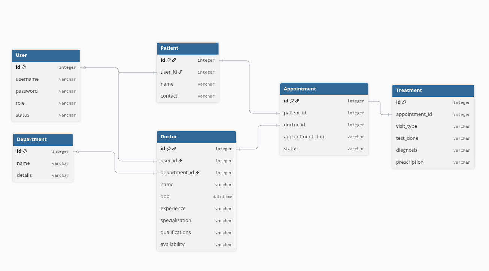

# A Hospital Management System for the MAD-I course project.

## Table of Contents
- [Introduction](#introduction)
- [Features](#features)
- [Technologies Used](#technologies-used)
- [Installation](#installation)
- [Usage](#usage)

## Introduction
The Hospital Management System (ApexCare) is designed to streamline the operational flows of a modern healthcare facility. Developed as part of IITM BS Degree's Modern Application Development I (MAD-I) course, the application facilitates seamless interaction between three key people: Administrators, Doctors, and Patients.

The system replaces manual record-keeping with a centralized database, ensuring data integrity, preventing appointment conflicts, and providing role-specific dashboards for efficient management.

## Features

### 1. Core Functionalities
- **Authentication**: Secure login for all roles and registration for patients.
- **Session Management**: Secure server-side session handling to protect routes.
- **Conflict Prevention**: Logic to prevent double-booking of doctors for the same time slot.

### 2. Admin Module

- **User Management**: Ability to Add, Edit, Blacklist, or Remove Doctors and Patients.
- **One-Time Credential View**: Secure generation of doctor credentials with a single-view policy for enhanced security.
- **Appointment Oversight**: View all hospital appointments and detailed treatment records.

### 3.Doctor Module

- **Dashboard**: Tabs for "Upcoming Appointments" and "Assigned Patients".
- **Availability Management**: Interface to update availability for morning/evening slots for the next 7 days.
- **Treatment Management**: Functionality to mark appointments as "Completed" or "Cancelled" and enter Diagnosis/Prescription details.
- **Patient History**: Access to the full medical history of assigned patients.

### 4. Patient Module

- **Department Browsing**: View department details and lists of specialists.
- **Doctor Search**: Search functionality for doctors by name or specialization.
- **Appointment Booking**: Dynamic booking system based on real-time doctor availability.
- **Management**: Options to Reschedule or Cancel booked appointments.
- **Medical History**: View past appointments, including diagnoses and prescriptions.

### 5. API Module
- **RESTful Architecture**: Implemented using the Flask-Restful extension to provide programmatic access to hospital data.

- **Resource Endpoints**: Dedicated GET endpoints for Doctors, Patients, and Appointments.

- **JSON Serialization**: Returns data in standard JSON format, enabling potential integration with external mobile apps or third-party services.


## Technologies Used
- Backend : Python Flask
- Database: SQLite (Relational Database)
- ORM: Flask-SQLAlchemy 
- Frontend: HTML5, CSS3, Bootstrap 5 (Responsive UI), Jinja2 Templating
- Forms & Validation: Flask-WTF
- Version Control: Git


## Installation

Follow these steps to setup project locally

1. Clone the Repository
```sh
git clone https://github.com/saicharanruka/mad-1-hms-project
cd mad1-hms-project

```
2. Set Up Virtual Environment
```sh
# Windows
python -m venv venv
venv\Scripts\activate

# macOS/Linux
python3 -m venv venv
source venv/bin/activate
```
3. Install Dependencies
```sh
pip install -r requirements.txt
```

4. Generate db and data
```sh
python create-db.py
```

5. Run app
```sh
python app.py
```

## ER Diagram




### AI Usage Declaration
It is acknowledged that **Google Gemini** was used in preparing this project. The tool was primarily used for HTML template generation and the dummy headings and paragraphs on the landing page.

---
